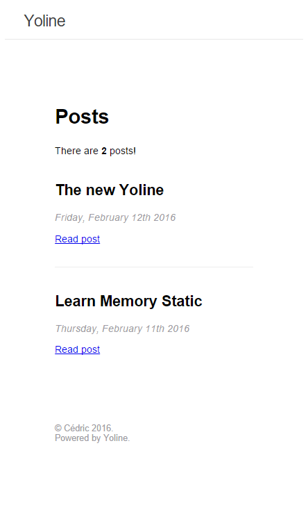

# Example of a Yoline Blog

A free and open-source blog based on Node.js.
It is __the smallest__ of the blog we can do, and that's the goal!

## How to configure the blog
There will be a [CLI](https://en.wikipedia.org/wiki/Command-line_interface) to create your own blog.

In the `content` folder you can create files: each file contains a post.
You can see [this]() file for example.

In the [config/meta.js]() file you can set:
* The blog title in `title`
* Your twitter account in `twitter` for the [SEO](https://en.wikipedia.org/wiki/Search_engine_optimization)
* The blog description in `description`
* The url of your blog in `url`, it will be important for the SEO
* The year in `year` for the [copyright](https://en.wikipedia.org/wiki/Copyright)
* The date format in `french`

## Why you choose this beautifull name?
Yoline is beautiful,  `y` reminds the front-matter in yml.
But after all, it's a close friend who gave me this name. She will given this name to her future daughter.
